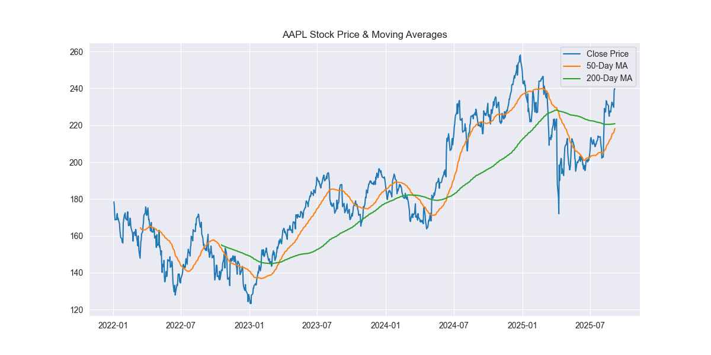

# 📈 Stock Market Dashboard (ML Project)

A data analysis + visualization project that fetches stock data using **Yahoo Finance API** and analyzes trends with **Python**.  
This project demonstrates practical data science + visualization skills for financial data.

---

## 🚀 Features
- Fetch real-time stock data from Yahoo Finance  
- Analyze **closing prices** with 50-day & 200-day moving averages  
- Compute **daily returns**  
- Plot **distribution of returns**  
- Show **trading volume analysis**  
- Compare multiple stocks with **correlation heatmap**  

---

## 🛠 Tech Stack
- Python  
- Pandas, NumPy  
- Matplotlib, Seaborn  
- yfinance  

---

## 📊 Example Outputs
### Stock Prices with Moving Averages


### Daily Returns Distribution


### Correlation Heatmap


---

## ⚙️ How to Run
1. Clone the repository:
   ```bash
   git clone https://github.com/YourUsername/stock-market-dashboard.git
   cd stock-market-dashboard
